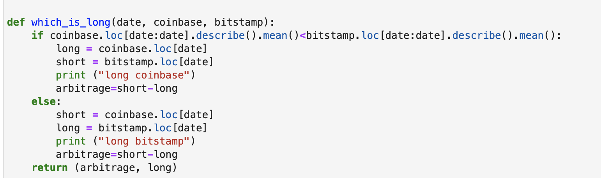

# Crypto-arb Application

This is a jupyter notebook application that allows users to see sort through historical trade data for bitcoin on two exchanges:  bitstamp and coinbase to apply the three stages of finanical analysis to see if any arbitrage opportunitites exist for bitcoin.

---

## Technologies

This project leverages python 3.7 and jupyer lab with the following packages:

* [pandas] (https://pandas.pydata.org/docs/user_guide/index.html)
pandas is a fast, powerful, flexible and easy to use open source data analysis and manipulation tool,
built on top of the Python programming language.
* [pathlib] (https://docs.python.org/3/library/pathlib.html)
offers classes representing filesystem paths with semantics appropriate for different operating systems

--
## Installation guide

import pandas as pd
from pathlib import Path
%matplotlib inline

## Usage
 
 Clone folder and open crypto_arbitrage.ipynb in Jupyter Lab 
 
 there is also a function called which_is_long that is used to choose the which 

---

## Installation Guide

pip install jupyerlab

---

## Usage

This notebook is failrly self explanatory.  However, there is a function that was written choose which exchange to long/short.

In the next version of this analysis, we should make the rest of the calculations and plots functions as well.  And Perhaps try to define a class called arbitrage or something along those lines with various functions and properties.

---

## Contributors
[ask the class](https://ucbvirtfinpt1-2k19388.slack.com/archives/C02PENN89GV)

---

## License

MIT
